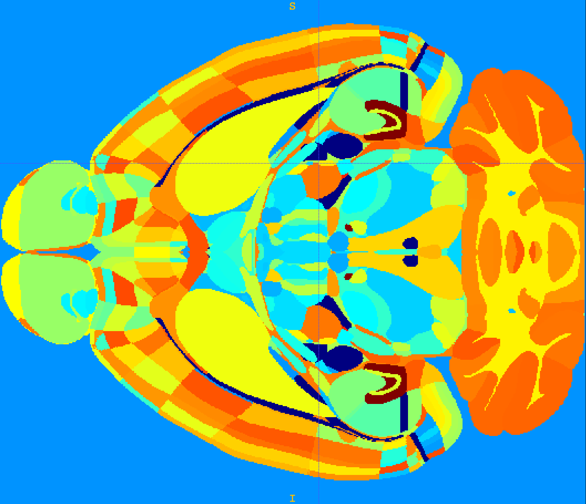
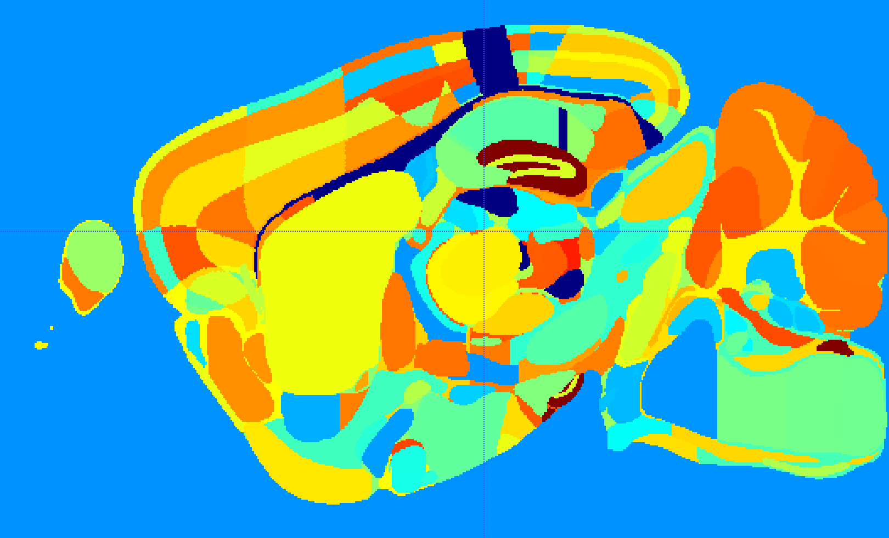
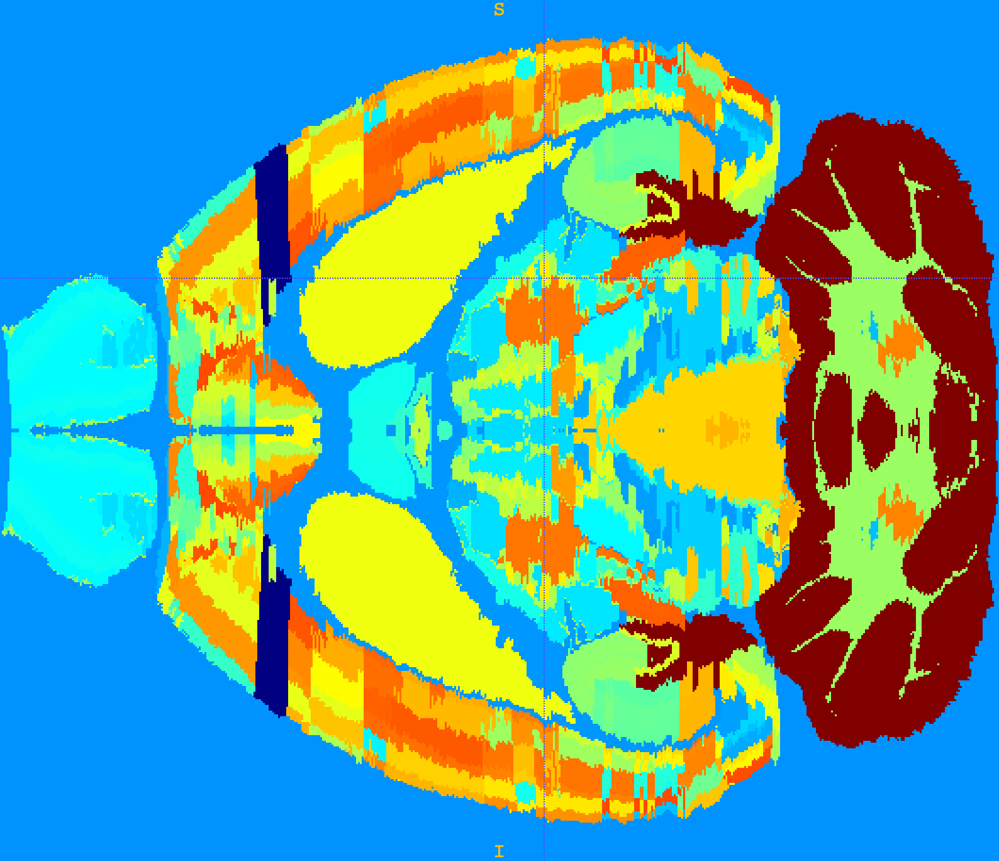
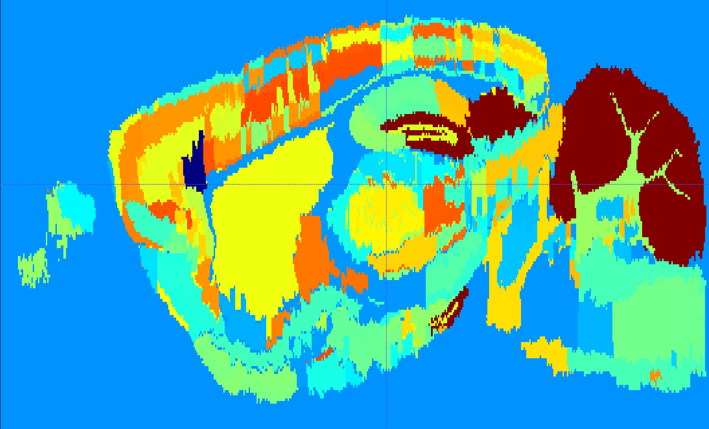

Pythonic tool (CLI and library) to measure the slice-to-slice jaggedness of a volumetric dataset (NRRD file only).

# Usage
install the last version:
```
pip install git+https://bbpgitlab.epfl.ch/dke/users/jonathanlurie/atlas-alignment-meter.git
```

Will probably move to `https://bbpgitlab.epfl.ch/dke/apps/atlas-alignment-meter.git` when no longer *beta*.

## As a CLI:
```
atlas-alignment-meter -i test_data/annotation_25_ccfv3.nrrd -o test_data/annotation_25_ccfv3.json
```
With `-i` for **input volume**, `-o` for **output json report**.  

To run it only on a selected subset or region IDs, use `-r` or `--regions` and a comma separated list (with no whitespace between them)
```
atlas-alignment-meter -i test_data/annotation_25_ccfv3.nrrd -o test_data/annotation_25_ccfv3.json -r 12,23,34,45
```

To run it on the *N* (ex. 10) largest regions of the volume:
```
atlas-alignment-meter -i test_data/annotation_25_ccfv3.nrrd -o test_data/annotation_25_ccfv3.json -r LARGEST,10
```

To run it on the *N* (ex. 10) smallest regions of the volume:
```
atlas-alignment-meter -i test_data/annotation_25_ccfv3.nrrd -o test_data/annotation_25_ccfv3.json -r SMALLEST,10
```
Note that the `-t` options followed by a number runs the CLI on the given number of threads. If not provided or providing `-t AUTO`, then the CLI run on *(max_number_of_thread - 1)* to not bloat the machine. Keep in mind that running a process on more threads than physically available will perform poorly.

More info with `atlas-alignment-meter --help`.

## As a Python library
To import *atlas-alignment-meter* into another codebase, we need to import its core:

```python
from atlas_alignment_meter import core
import nrrd

# load your volume and all:
volume_data, volume_header = nrrd.read("some_path/to_volume.nrrd")

metrics = core.compute(volume_data)
```

and with some more options:
```python
metrics = compute(
    volume_data, 
    coronal_axis_index = 0, # for future non-along-faster-axis improvement
    regions = [1, 2, 3, 4], 
    precomputed_all_region_ids = None, # mainly intended to be used from CLI not not recompute it, don't pay attention to it 
    nb_thread = 3
  )
```

# What's a jagged volume
Some imagery capture methods rely on slicing a brain mechanically , capturing a picture of each individual slice and later reconstruct the volume from slices digitally stuck together in the correct order. One drawback of this method is the slight displacement of each slice to the next, resulting in volume being imperfectly aligned along the axis orthogonal to the slicing plane.

Here is an illustration of a smooth (not jagged) volume:

AIBS CCFv3 axial             |  AIBS CCFv3 sagittal
:-------------------------:|:-------------------------:
  |  


As a comparison, here is a jagged volume:

AIBS CCFv2 axial             |  AIBS CCFv2 sagittal
:-------------------------:|:-------------------------:
  |  

# Why measuring the jaggedness?
Providing such metric is important mostly to evaluate the quality of the volume alignment, from `1` (very jagged volume, basically white noise) to `0` (no jaggies at all, basically a unified blob of a single value).  

At Blue Brain, we also have some procedures to obtain a smooth volume from a jagged one, with the purpose of placing cells or building circuit. Hence, it is key to provide a metric to evaluate the efficiency of the re-alignment process and eventually improve it.

# Method
## General
*In the following, we will assume as a generality that the coronal plane is always the capture plane, and that the purpose is to measure the jaggedness along the anterior-posterior axis.*  

For a given region of interest (ROI) that we convert into a binary mask, we measure its distribution on each slice compared to the next. To achieve that, we use the following method:

<span style="text-align: center;">


</span>

In plain English, this could be summarised as follow:  
> "What is the ratio of ROI voxels that are diffent from one slice to the next over the total count of ROI voxels in these two slices?"

With:
- *N*: the count of voxels belonging to the ROI 
- *i*: the coronal slice index

The pros of this methods are:
- relatively basic and cost efficient
- the result is bounded in the interval *[0, 1]*
- no division by zero possible (since only computed on ROI)

The cons of this method (and how they are worked around) are:
- The slice just before the begining of a region or the slice just after the end will have `0` voxel of this ROI, hence the ratio is always going to be `1.0`. Furthermore, a ratio of `1.0` can happen only in this particular case. Since we do not want to measure where a ROI is starting or ending but only want to measure the jaggedness happening within a ROI, we can just safely remove all the `1.0` from our set of measures. The reason for removing those values is that a ratio of `1.0` would add a bias to the final measures, making a ROI looking more jagged than it actually is.
- The method is based on a difference from a slice to the next, as a result, it will not be possible to compute this value for the very last slice fo the volume. The solution is to simply not compute the ratio on the last slice and making it *nullish*.

**Note 1:** the *no data* part around the brain is *NOT* considered as a ROI and its score is not computed.  

**Note 2:** The final score, from a pair of slices or averaged on a whole volume, will not tell whether or not a volume has an acceptable jaggedness, as this entirely depends on the conducted experiment and the eye of the scientist. To compensate for this lack of objectivity, the best course of action is to run this method on a reference volume, either an unacceptably jagged one or a very smooth one (or both). This will minimize the interval of confidence and help bearing a judgement on a candidate volume. 

## Part 1: The per-region metrics
It may happen that an annotation volume is aligned with an algorithm that takes into consideration mostly its external envelope and does not process the alignement on internal structure. As a result, the whole brain mask would be fairly smooth but the internal parts would still be very much jagged.  

The proposed method adopts a per-parcellation tactic, creating a ROI (binary mask) for all the unique regions present in an annotation volume. Then, for each ROI mask, a slice-to-slice approach is ran.  
For each ROI are provided the `mean`, `std` and `median` of the difference ratio.

## Part 2: The per-slice metrics
When the computation of **part 1** is done on all available (or desired) regions, a per-slice aggregation of ratios is done to provide metrics such as `mean`, `std`, `median`, `min` and `max` of difference ratio on each slice.  
**Important notice:** some slices may not be populated by any ROI, or be populated by less ROI than other slices. In order to avoid a *no data bias* that would artificially lower the score (and make slices less jagged than they actually are), the per-slice approach is only taking into account the ROIs that are actually present on this particular slice index, discarding the `null` of the other ROIs that not present. (in other word, the absents are not part of the computed statistics).

## Part 3: The global metrics
Comparably to the the *per-slice* approach, the metrics related to the global score (`mean`, `std`, `median`, `min` and `max`) are computed after discarding all the *no data* of outside the brain and the *no data* around each ROI.  
As a general comment, the global metrics are best suited for a not-too-in-depth sneek peak into the jaggedness metrics.

# Output
A Pyton dictionnary is outputed and can be saved as JSON. Samples of these JSON files can be found in the folder `test_data/*.json`, where they are related to the volumes of the same name `*.nrrd`.

Here are some interesting global values from AIBS CCF v2 (jagged):
```json
{
  "mean": 0.24857328984712668,
  "median": 0.19326241134751773,
  "std": 0.18146920902864508,
  "min": 0.0037735849056603774,
  "max": 0.9971671388101983
}
```

From AIBS CCF v3 (smooth):
```json
{
  "mean": 0.13067491908784817,
  "median": 0.0743801652892562,
  "std": 0.15140213631276536,
  "min": 0.0009910802775024777,
  "max": 0.9948453608247423
}
```

From the ML aligned candidate (rather smooth outer hull but quite jagged internals):
```json
{
  "mean": 0.28250164209832207,
  "median": 0.2171945701357466,
  "std": 0.200293614299299,
  "min": 0.011627906976744186,
  "max": 0.9988348383338188
}
```

While the `min` and `max` metrics are difficult to make sense of (or maybe even irrelevant), the `median` shows that CCF v3 is `2.6x` less jagged than CCF v2 (and almost `2x` according to the `mean`).  
Following this logic, we can say that the ML-aligned candidate is even jaggier than the original CCF v2, which is the opposite its original intention.


# Current limitations
## File format
Only NRRD files are compatible for the moment. Though if other formats are necessary (ex. NIfTI) we could add those in the future.

## Type of dataset
As of now, this tool only works for annotation volumes encoding parcellations. This would not work on a NISSL/Golgi stained dataset.

## File encoding and orientation
As of now, the comparison from one slice to the next only applies for slices being orthogonal to the fastest varying axis.  
For example, following the [NRRD format spec](http://teem.sourceforge.net/nrrd/format.html#sizes), the NRRD header entry `sizes: 528 320 456` implies that:
- the fastest varying axis has a size of 528 elements (voxels)
- the intermediate axis has a size of 320 elements
- the slowest varying axis has a size of 456 elements

Then, looking at datasets such as AIBS Mouse CCF v3 volume in 25um (no rotation), we know that those axis, in respective order, corresponds to:
- the anterior (0) to posterior (527) X axis
- the superior (0) to inferior (319) Y axis
- the left (0) to right (455) Z axis

As a result, the image plane orthogonal to the X axis is represented by 2D images that are on Y-by-Z, where lay the coronal slices. If in the future there is a need for the reference slice orientation to be different than along the fastest varying axis, then an update will be done to this module.  

(For example, the rat atlas volume has its coronal slices on the X-by-Z place and its aterior-to-posterior axis on Y)